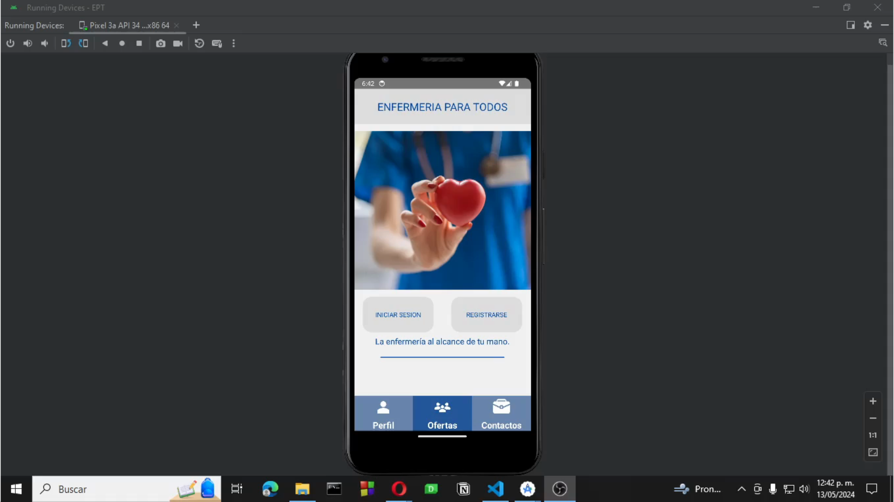
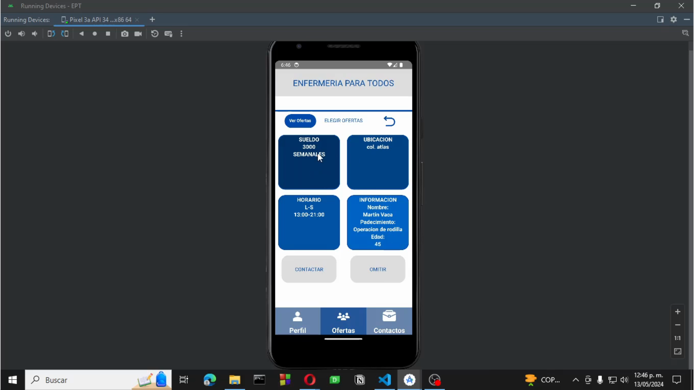

#  RECOMENDACION INTELIGENTE DE TRABAJO A ENFERMEROS
Proyecto escolar de la materia Ingenieria de Software.

## DESCRIPCIÓN
Se creó un proyecto en React-Native en el cual un enfermero encontrara ofertas de trabajo,
y conforme se interactua con las ofertas se analizan las elecciones para recomendar ofertas similares,
se usó la similitud por coseno para la recomendación.

## Imagenes del proyecto

### Iniciar sesion

### Oferta 1

### Oferta 2

